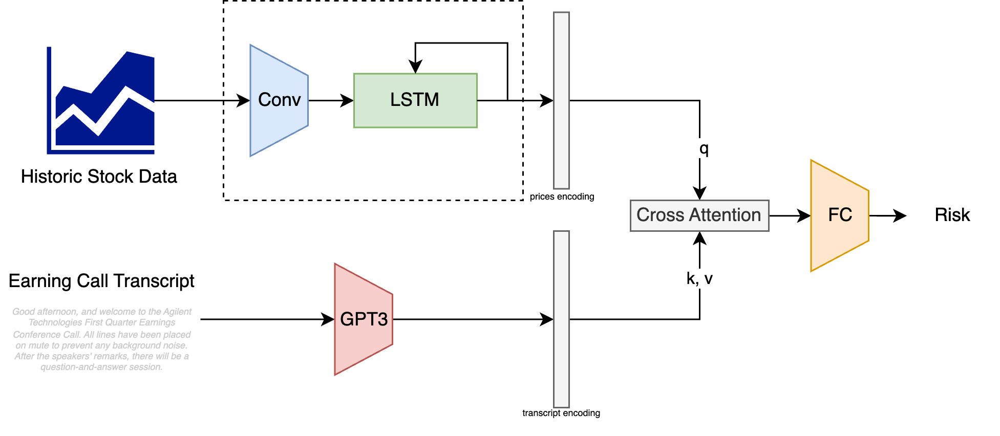

# ArcanaHackathon
```Team: Hacker Bois```

# Documentation

## Data Structure

    .
    ├── README.md                               # Documentation  
    ├── FMP
    ├──── <Stock Name 1>
        ├──── <Year(s)>                         # Folder containing the Earning Call Transcripts for the 4 Quarters in that Year.
        └──── price.csv                         # CSV file containing the historic data for close and volume of the particular stock.
    ├──── <Stock Name 2>
        ├──── <Year(s)>
        └──── price.csv
    ├── prices
        ├──── bq-results-<date>-<time>-<id 1>.csv # CSV file containing the data for close and volume of all stocks.
        ├──── bq-results-<date>-<time>-<id 2>.csv
        └──── bq-results-<date>-<time>-<id 3>.csv
    ├── scripts
        ├──── preprocess.sh                     # bash script to parse through the CSV files in the prices directory to automatically segregate the transcations according to stocks.
        └──── predictor.py                      # script to predict the risk quantity in the next quarter.

## Pre-Processing 

Pre-processing the consolidated historic stock data includes
- parsing over all the CSV files
- segregating the data based on the Stock Name
- sorting with respect to date

To perform the pre-processing, we employ a multi-threaded method that queries the stock in question (essentially, the stock for which the transcript data exists), to retrive the close and volume on all the dates in all CSV files present in the prices directory.

### Usage
```bash
./scripts/preprocess.sh 

```
## Predicting the Risk

We employ a novel model to predict the risk for the upcoming quarter by utilizing the Historic Stock Data and the Earning Call Transcripts for that quarter.

The proposed architecture is as follows


We input the Historic Stock Prices and use a `conv1d` layer to replicate a moving average computation. The "averaged" prices are passed onto an `LSTM` layer to learn the dynamics of the stock. Parallelly, the Earning Call Transcripts and query `GPT3` to get strong encodings. </br>
Both these contexts are combined using a `cross-attention` block followed by a `fully-connected` layer to predict the risk associated with the next quarter.

### Usage
```python
predictor = QualitativePredictor("AAPL")
predictor.fit(max_epochs=20)

print(predictor.predict_next())
```